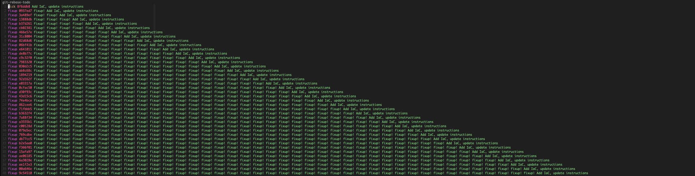

# Rebase


_source <https://www.atlassian.com/git/tutorials/rewriting-history#git-rebase-i>_

!!! quote "quote from _<https://www.atlassian.com/git/tutorials/rewriting-history#git-rebase-i>_"

    This gives you the opportunity to alter individual commits in the process, rather than moving all commits.

!!! tip
    
    ```shell
    $ git fetch –all
    $ git rebase -i origin/master --autostash
    ```

## Rebase interactive in action (basic)

What we get after `git rebase -i master`:

!!! info "git-rebase-todo"
    
    ```shell
        pick 3648b69 Meaningful message
        pick 929dbs2 Fix typo
        pick a9di923 Another meaningful message
        pick k372b37 Fix to previous typo fix
        
        # Rebase 12d65ea..k372b37 onto 12d65ea (4 commands)
        #
        # Commands:
        # p, pick <commit> = use commit
        # r, reword <commit> = use commit, but edit the commit message
        # e, edit <commit> = use commit, but stop for amending
        # s, squash <commit> = use commit, but meld into previous commit
        # f, fixup [-C | -c] <commit> = like "squash" but keep only the previous
        #                    commit's log message, unless -C is used, in which case
        #                    keep only this commit's message; -c is same as -C but
        #                    opens the editor**
        # x, exec <command> = run command (the rest of the line) using shell
        # b, break = stop here (continue rebase later with 'git rebase --continue')
        # d, drop <commit> = remove commit
        # l, label <label> = label current HEAD with a name
        # t, reset <label> = reset HEAD to a label
        # m, merge [-C <commit> | -c <commit>] <label> [# <oneline>]
        #         create a merge commit using the original merge commit's
        #         message (or the oneline, if no original merge commit was
        #         specified); use -c <commit> to reword the commit message
        # u, update-ref <ref> = track a placeholder for the <ref> to be updated
        #                       to this position in the new commits. The <ref> is
        #                       updated at the end of the rebase
        #
        # These lines can be re-ordered; they are executed from top to bottom.
        #
        # If you remove a line here THAT COMMIT WILL BE LOST.
        #
        # However, if you remove everything, the rebase will be aborted.
        #
    ```

Commands like `pick`, `reword` or `edit` are self-explanatory, but let's focus on `squash` and `fixup`.
We changed order of commits and edited commands to clear history.

!!! info "reordered commits"
    
    ```shell
        pick    3648b69 Meaningful message
        squash  a9di923 Another meaningful message
        pick    929dbs2 Fix typo
        fixup   k372b37 Fix to previous typo fix
    ```

After saving it the window will be closed and we will be asked to edit commit message.

!!! info "`COMMIT_EDITMSG`"

    ```shell
    # This is a combination of 2 commits.
    # This is the 1st commit message:
    
    Meaningful message
    
    # This is the commit message #2:
    
    # Another meaningful message
    ```

After editing it as `Brand new and more meaningful message` and saving it we are done. History of branch loos like this:

!!! info

    ```shell
    $ git bdog master
    * 132df6e (HEAD -> feature/jira1234) Fix typo
    * cc0fe50 Brand new and more meaningful message
    ```

## Rebase interactive in action (fixup!)

Let's say we have two commits in our branch so far.

!!! info

    ```shell
    $ git bdog master
    * 132df6e (HEAD -> feature/jira1234) Fix typo
    * cc0fe50 Brand new and more meaningful message
    ```

So last commit is `Fix typo`, but we see we have a lot of typos in our code.
We want to fix them but also want to achieve two contradictory things:

 * we want to keep (temporarily) all typo fixes in separate commits.
 * we want to have clean history after we are done so we will `fixup` all commits into one.

Let's see how we can do it and explain later.

Let's start with fixup to the specific commit.

!!! info "Fixup to the specific commit"

    ```shell
    # we did some typo fixes
    $ git commit -a --fixup 132df6e
    ```

We make another typo fixes and we want to fixup our last commit but we instead of checking hash of the commit we want to fixup we can use `@` (is just a synonym/alias/shortcut for the special Git reference `HEAD`).

!!! info "Fixups to the last commits"

    ```shell
    # we did another typo fixes
    $ git commit -a --fixup @
    # so many typos ...
    $ git commit -a --fixup @
    ```

Enough typos, but our first commits needs some love too.

!!! info "Fixup to the specific commit"

    ```shell
    # cc0fe50 Brand new and more meaningful message
    $ git commit -a --fixup cc0fe50
    ```

This is how our `git-rebase-todo` history looks like now:

!!! info

    ```
    $ git rebase -i master

    pick cc0fe50 Brand new and more meaningful message
    pick 132df6e Fix typo
    pick 86c1657 fixup! Fix typo
    pick 0a3f0a2 fixup! fixup! Fix typo
    pick c15c724 fixup! Brand new and more meaningful message
    ```

We can see the naming pattern but still manual editing is needed. 
We are tired after fixing all those typos and we want to be done with it.

This is what we want:


!!! info

    ```shell
    $ git rebase -i master
    
    pick cc0fe50 Brand new and more meaningful message
    fixup c15c724 fixup! Brand new and more meaningful message
    pick 132df6e Fix typo
    fixup 86c1657 fixup! Fix typo
    fixup 0a3f0a2 fixup! fixup! Fix typo
    ```

### Automate fixup!

We can automate this process by using `git rebase -i master --autosquash`.
When use this command we will get the same result as above but without manual editing.

!!! info

    ```
    $ git rebase -i master --autosquash

    pick cc0fe50 Brand new and more meaningful message
    fixup c15c724 fixup! Brand new and more meaningful message
    pick 132df6e Fix typo
    fixup 86c1657 fixup! Fix typo
    fixup 0a3f0a2 fixup! fixup! Fix typo
    ```

Everything in order, everything is fixed, we are done, we can move on.

!!! info

    ```
    $ git bdog master

    pick 7a76c69 Brand new and more meaningful message
    pick a4003d8 Fix typo
    ```

### Real life example


